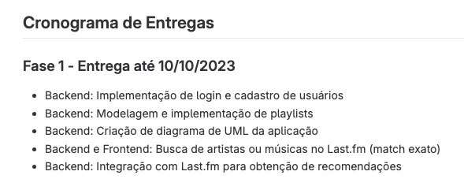

Notion: https://www.notion.so/zevolution/MAC5714-Projeto-Final-e831e55419dd401c821f56d532b1ee1a

Gitlab: https://gitlab.com/joaomi/song-seeker

TO-LEARN:
- Kotlin (backend)
- Springboot (frontend)
- Banco de dados Postgres (bd)

Fase 1: Backend: integração com Last.fm para obtenção de recomendações
- Criar integração cliente com Last.fm
- Criar portas para requisitar recomendações

    import org.springframework.beans.factory.annotation.Value
    import org.springframework.http.ResponseEntity
    import org.springframework.web.bind.annotation.GetMapping
    import org.springframework.web.bind.annotation.RequestParam
    import org.springframework.web.bind.annotation.RestController
    import org.springframework.web.client.RestTemplate

    @RestController
    class LastFmController(private val restTemplate: RestTemplate) {

        @Value("\${lastfm.apiKey}")
        private val lastFmApiKey: String

        @GetMapping("/recommendations")
        fun getRecommendations(@RequestParam artistName: String): ResponseEntity<List<String>> {
            val url = "http://ws.audioscrobbler.com/2.0/?method=artist.getsimilar&artist=$artistName&api_key=$lastFmApiKey&format=json"

            val response = restTemplate.getForObject(url, LastFmResponse::class.java)
            val similarArtists = response?.similarartists?.artist?.map { it.name } ?: emptyList()

            return ResponseEntity.ok(similarArtists)
        }
    }

    data class LastFmResponse(val similarartists: SimilarArtists)

    data class SimilarArtists(val artist: List<Artist>)

    data class Artist(val name: String)

