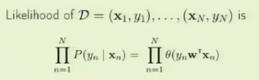
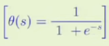
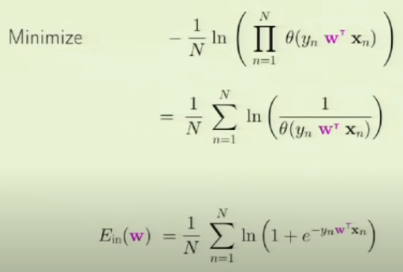

# Machine Learning

- Aulas da Nina: https://edisciplinas.usp.br/course/view.php?id=86532
- Aulas do livro Learning from Data: https://www.youtube.com/watch?v=mbyG85GZ0PI&list=PLD63A284B7615313A&ab_channel=caltech

- Learning From Data, Mostafa: https://edisciplinas.usp.br/pluginfile.php/7566295/mod_resource/content/1/learningrf.pdf
- Python Machine Learning, Sebastian

## Dúvidas

- É importante saber as contas do gradiente de Ein?
  - Descobri por conta própria que é importante para o algoritmo da regressão linear

## Conceitos anteriores

- Com um conjunto de hipóteses pequeno é esperado que a função alvo esteja distante, assim tem um bias grande (suposições simples).
- Se o conjunto for grande, o bias será pequeno ou nenhum (se ajusta melhor aos dados de treinamento), mas a variância dependerá da hipótese.
  - Variância: sensibilidade do modelo às variações nos dados de treinamento.
  - Bias: diferença sistemática entre as previsões do modelo e os valores reais da variável-alvo. 

## Learning curves

Como Ein e Eout varia com N:

- Desempenho da aproximação apenas dentro da amostra
- Quanto maior o tamanho da amostra menor é o Eout
  - Com mais exemplos para aprender, é provável um melhor desempenho fora da amostra
- Quanto menor o tamanho da amostra menor o Ein
  -  Com menos exemplos há sempre os mesmos recursos para ajustar, então se ajusta melhor
- Erro de generalização: diferença entre Eout e Ein

- Como a sua melhor hipótese aproxima o alvo

- O número de exemplos necessários para atingir um certo desempenho é proporcional à dimensão VC.

- Linear classification
   - Perceptrons
- Linear regression
   - one step learning

## Regressão Linear

capítulo 3, página 82 (Mostafa)
videoaula: https://youtu.be/FIbVs5GbBlQ?t=1299

- Regressão: saída com valor real.
- Função real: problema de regressão.

### Exemplo 

Digamos que você gostaria de relacionar o seu desempenho em diferentes tipos de disciplinas aos seus ganhos futuros. E você obteve um grau (nota) em cada uma delas. Após 10 anos após a graduação observamos a sua renda anual.

Assim, as entradas são os graus das disciplinas, no momento em que você se formou. A saída é quanto dinheiro você ganha por ano, 10 anos depois.

Pergunta: como estas variáveis afetam a saída?

Aplicando a regressão linear podemos analisar quais disciplinas foram mais importantes para o resultado 10 anos depois.

### Exemplo do crédito

- Classificação: aprovação de crédito (yes/no)
- Regressão: limite de crédito (depende da entrada)
- Input: x = dados do cliente
- Output da regressão linear: h(x)
  

- É regressão pois a saída é real
- É regressão linear pois a forma em termos da entrada é linear
- Anteriormente lidamos com h(x) como sendo -1 e +1, agora não limitamos a saída e consideramos h(x) como um número real.
- É importante que seja linear e resulte em um vetor (algoritmo).

### Error

Em regressão linear usamos o erro quadrático

- Antes o erro era binário (acertou ou não), a frequência era calculada para obter Ein e Eout.
- Agora medimos o "quão boa ou ruim a situação é".
- Medida de erro: erro quadrático.
- h depende de w.
- MSE (Mean Squared Error).

- O algoritmo deve diminuir esse erro.

### Illustration of linear regression

- Exemplo das notas daqui 10 anos
- Nota geral = x
- Ganhos daqui 10 anos = y
- Regressão linear tenta produzir uma reta que tenta se ajustar aos dados de acordo com o erro quadrático

- Threshold depende do w0 e inclinação depende do w1 (peso para o x).
- Soma dos erros em vermelho é a MSE
- Regressão linear pode ser aplicada a mais de uma dimensão:

- Em geral, quando se considera um espaço de dimensão superior, a "linha" não é realmente uma reta é um hiperplano, uma dimensão a menos que o espaço que está sendo trabalhado.

### Erro interno (Ein)

- Expressão analítica que queremos minimizar
- Do Ein derivamos o algoritmo de regressão linear

- Como é uma regressão linear, o valor h(xn) é w transposto xn (função linear do xn).

- Forma vetorial:

- Colocamos os vetores xn em uma matriz e os yn em um vetor
- O yi é a saída de cada vetor xi

- X é uma matriz muito alta

#### Minimização do Ein

- Estamos apenas variando **w**, Ein depende de w
- Para tentar minimizar:
  - obtemos a derivada e igualamos a 0
  - derivada conhecida como **gradiente**
  - gradiente é a derivada de vários Ein, todos de uma vez
  - vetor de 0, todas as derivadas são zero de uma vez
  - isto vai definir um ponto em que essa expressão atinge um mínimo

- Para que os termos nos parenteses se cancelem e a derivada seja zero temos:

- Ordenando essa igualdade temos o valor de w, que é o que procuramos

### Learning Algorith da Regressão Linear - Adaline

### Generalization issues
- Procurar o vetor w na regressão linear garante um Eout decente? A resposta é sim.
- Existe uma versão da regressão linear do VC generalization bound

### Linear regression for classification

- A regressão linear aprende uma função real
- Funções binárias (funções de classificação) também são funções reais (-1 e +1 são números reais)
- Usamos regressão linear e verificamos se o conjunto de soluções está próximo do conjunto yn em questão de sinais positivo e negativo

- O classificador final é obtido depois de um threshold

- Perceptron é lento, pois usa um w aleatório até chegar à região de interesse para convergir
- Então podemos usar a regressão linear para obter os w's, que são razoáveis mas não estão realmente adaptados para classificação, mas são bons para iniciar

## Regressão Logística

videoaula: https://youtu.be/qSTHZvN8hzs?t=1442

### Comparando modelos lineares

- Ser linear significa que nós consideramos as suas entradas, calculamos um sinal s que é uma combinação linear da entrada com pesos, e então eu considero o s e efetuo uma operação nele.

- A operação poderia ser a **classificação linear** (os perceptrons). 
  - A hipótese é uma decisão +1 ou -1 e essa decisão é um limiar direto do sinal com relação ao zero.

- Também poderia ser a **regressão logística** (Adaline). 
  - Não fazemos nada com o sinal, deixamos o valor original em número real

- E agora temos a **regressão logística**. 
  - Consideramos o s e aplicamos uma não linearidade a ele. 
  - A não linearidade (teta) não é tão rígida quanto a classificação linear, é algo entre a classificação linear e a regressão linear
  - Devolve um valor real
  - A saída será interpretada como uma probabilidade

### The logistic function Θ

stopped: https://youtu.be/qSTHZvN8hzs?t=1661