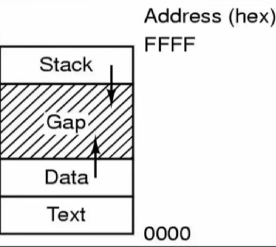

# PF

parei: 104/229

slides: 1 - 152 - 229 - 259 ; 380 - 403 (ao todo cerca de 60 slides)

respostas das provas: https://docs.google.com/document/d/1htvzhlW3EPrYwOh2mBsPRAcDP2JfZFJfiu5Z6QvfnTY/edit?pli=1

## Dúvidas

- TIME: requires a contex mode switch to kernel-mode
- Os registradores guardam os endereços virtuais ou físicos?

# Matéria P1

## Conceitos e história

- Sistema computacional/ Arquitetura de um computador
    - Barramentos: trilhas de comunicação, uma mensagem de cada vez
    - CPU: unidade central de processamento
        - Processador: program counter (PC), pilha, status...
    - Memória primária: memória RAM por exemplo
    - Mmemória secundária: HD por exemplo, memória persistente
    - Dispositivos de E/S: discos, vídeo, teclado, ...
        - CPU não se comunica com o dispositivo e sim com o controlador

## Sistema Operacional

- Importância do SO
    - Suporte para as aplicações
    - Tradutor para as aplicações se comunicarem com o hardware
    - Usuário -> Aplicação -> Rotina de E/S -> Hardware

- Processamento: dois tipos de SO
    - Monoprogramação: único programa fica na RAM até seu fim
        - Recursos mal utilizados, ociosidade
        - Três estados: execução nova -> executando -> terminada
        - Simples
    - Multiprogramação: vários programas dentro do sistema, compartilham tempo de CPU e recursos
        - Menos ociosa
        - Tarefas simultâneas (vários cores)
        - Enquanto uma espera, outra roda
        - Trocas rápidas de processos
        - Sistemas batch (em lotes)
            - lote de programas de uma vez
            - sem interação com o usuário
        - Sistemas de tempo compartilhado  
        - Sistemas de tempo real (tempo estipulado)
            - Tempo é um fator crítico
        - Mais sofisticado, mais processamento

- Estruturas do SO
    - Estrutura monolítica
        - Módulo kernel (núcleo) e módulo usuário
        - UNIX, Windows
    - Estrutura microkernel
        - Principal função do kernel é gerenciar comunicações de processos
        - Maior parte das funções do SO em processos de usuário
        - MINIX
    - Estrutura de camadas
        - Divisão de um programa complexo em módulos menores
        - Hierárquico
        - MULTICS, OpenVMS

## Chamadas de sistema e Interrupção

- Chamadas de sistemas
    - Se uma aplicação precisa realizar uma instrução privilegiada
        - Leitura no disco
        - Rotina de serviço
    - Altera do modo usuário para modo kernel
        - Ler um arquivo
    - Exemplos:
        - printf (write() e exit() na tela ou no arquivo)
        - fork (criação de processo)
    - Chamadas de sistemas são realizadas por instruções Traps
        - Pega a requisição do usuário, identifica o endereço da chamada e processa  as intruções no sistema operacional
        - Interrupções em nível de software
        - Aplicação para a execução e depois da chamada continua a execução de onde parou
            - Salva registradores
    - Interfaces das syscalls
        - Aplicações utilizam API
        - Disfarçar complexidade
        - POSIX: padrões de interface

- Interrupções
    - Nível de software temos traps
        - Traps (chamadas de sistema)
        - De dentro do processador para fora
    - Nível de hardware temos interrupções
        - Dispositivos de E/S
        - Clock
        - Sinais elétricos
        - De fora do processador para dentro
        - Procura rotina de tratamento de interrupção
        - Procura o que causou a interrupção
        - Mesmo esquema de traps

## Processos

- Programa em execução
- Instância de um programa
- Código acompanhado de dados e estado
- Possui dados de entrada, dados de saída e um estado
- 3 Estados:
    - Executando
        - Manuseia o processador
        - Tem a CPU
    - Bloqueado
        - Chamada de sistema ou interrupção
        - Incapaz de executar enquanto um evento externo não ocorrer
        - Está esperando algo
    - Pronto
        - Possui tudo menos CPU
        - Aguardando disponibilidade
    - Também pode ter 5 com o Suspenso:
        - Suspenso bloqueado
        - Suspenso pronto
- Componentes do processo:
    - Conjunto de instruções
    - Espaço de endereçamento
        - Espaço reservado para ele trabalhar
    - Contexto de hardware
        - Valor nos registradores (PC), ponteiro de pilha, etc
    - Contexto de software
        - Atributos em geral, recursos
- Espaço de endereçamento
    - Text: código executável
    - Data: variáveis temporárias armazenadas
    - Stack: controla execução

    

    - Gap entre stack e data, para proteger caso a pilha "vaze" por causa do tamanho menor do que o que ela armazena

- Tabela de processos
    - Múltiplos processos em execução
    - Elementosdo contexto de cada processo:
        - Ponteiros de arquivos abertos, posição do byte a ser lido, etc
    - Tabela de processos tem entrada para tabela de endereços de cada processo, para a tabela não ficar extensa

- Características de processos
    - CPU-bound: processos que utilizam mais CPU
    - I/O-bound: processos que utilizam mais dispositivos de E/S
    - O ideal é ter um balanceamento entre esses dois tipos

- Formas de criação de processos
    - Inicialização do sistema
    - Execução de uma system call
    - Requisição de novo processo pelo usuário
    - Inicialização de um processo em batch

- Processos criando outros processos
    - UNIX: com a função fork()
        - Cria clone do processo pai, cópias exatas mas identificadores diferentes (espaço de endereçamento também)
    - Windows: CreateProcess
    - São chamadas de sistema (trap)

- Finalizando processos
    - Término normal: voluntário, tarefa finalizada
    - Término por erro: voluntário, processo não pode ser finalizado
    - Término com erro fatal: involuntário, erro, bug
    - Termino involuntário por outro processo: kill (UNIX)

## Escalonamento

- Escalonador: processo/módulo do SO que seleciona próximo processo a ser executado
    - Nível mais baixo do SO

- Mudança de contexto
    - Overhead de tempo, tarefa cara, pois precisa armazenar conteúdo do processo, depois alocar novamente no processador

- Quando o escalonador é chamado?
    - Novo processo
    - Fim do processo
    - Processo bloqueado, outro deve ser executado

- Categorias do escalonador
    - Preemptivo
        - Processo perde uso da CPU
        - Interrupção forçada para outro processo usar CPU
    - Não preemptivo
        - Permite que o processo sendo executado continue executando
        - Ignora evento
        - Não perde uso da CPU

- Algoritmos de escalonamento
    - Data limite
    - Sistemas Batch (lote) (conjunto de processos para serem executados, usuário só vê resultado no final)
        - First In First Out (FIFO)
            - Não preemptivo, só são interrompidos voluntariamente por E/S
            - Seguem ordem de requisição
            - Desvantagem quando há processos que demoram na execução
        - Shortest Job First (SJF)
            - Não preemptivo
            - Tarefas mais curtas
            - Jobs precisam ser conhecidos antes
            - Jobs longos podem demorar para serem executados
        - Shortest Remaining Time First (SRTN)
            - Preemptivo
            - Versão preemptiva do SJF
            - Menor tempo restante é executado
            - Suspende se processo com tempor menor chega
    - Sistemas Interativos (interação com o usuário)
        - Prioridade
            - Preemptivo
            - Maior prioridade são executados primeiro
        - Round-robin
            - Preemptivo
            - Cada processo recebe um tempo de execução igual (quantum)
            - Fila circular
            - Problema: chaveamento de processos (trocas de processos)
            - Exemplo: no banco tem uma fila que só pode pagar 5 contas de uma vez, se a pessoa tiver mais de 5 contas ela volta no final da fila para pagar as restantes
        - Multi-level queues
            - Quantum diferente para cada fila
            - Menor quantum maior prioridade
            - Round-robin em cada fila
        - Multi-level FEEDBACK queues
            - Interrupção de tempo reduz prioridade
            - Promoção: tempo sem rodar, interrupção I/O
    - Sistemas de Tempo Real (possuem deadline para execução)
        - Data limite
            - Processo ao iniciar determina quando sua tarefa precisa estar completa
            - Planejamento complexo: envolve cuidadosa estimação de uso dos recursos do sistema (disco, CPU, etc.)
            - Sobrecarga de planejamento, pois é complexo

## Comunicação entre processos

- Se comunicam através de alguma área de armazenamento comum
- Condição de corrida: dois ou mais processos acessam recursos compartilhados concorrentemente, corrida pelo recurso
- Problema de sincronização

- Exclusão mútua: restringir região crítica que possuem recursos compartilhados
    - Um processo não terá acesso à uma região crítica quando outro processo estiver nela

- Importante exclusão mútua para threads, pois compartilham o mesmo espaço de endereçamento

## Exclusão mútua

- 4 condições para uma boa solução
    1. Só um processo deve entrar na região crítica de cada vez
    2. Não deve ser feita nenhuma hipótese sobre a velocidade relativa dos processos
    3. Nenhum processo executando fora de sua região crítica deve bloquear outro processo
    4. Nenhum processo deve esperar um tempo arbitráriamente longo para entrar na sua região crítica (adiamento indefinido) (inanição)

- Soluções de espera ocupada (solução para exclusão mútua)
    - Verificar se a região crítica está ocupada ou não
    - Exclusão mútua: excluir um dos processos para apenas um entrar na região crítica
    - Solução 1: inibir interrupções
        - Desabilita interrupção do processador, impede que o processador faça o chaveamento de processos
        - Impede que outro processo entre na região crítica
        - Só funciona em ambientes monoprocessados
        - Pode resultar em inanição de outros processos
    - Solução 2: lock
        - Usar variável lock para permitir entrada ou não de um processo
        - Não funciona, pois pode haver interrupções que atrapalham
    - Solução 3: alternância explicíta
        - Um processo não pode passar pela região crítica duas vezes
    - Solução 4: Peterson
        - Avisa quando quer entrar na região crítica, entra quando é seguro e sai avisando que saiu.
    - Exclusão mútua por hardware: usa Peterson com TSL (test and set lock)
    - Desvantagem: desperdiça tempo de CPU, a consulta constante causa ciclos de processamento (ociosidade?)

- Semáforos (SO/compiladores)
    - Variável para controlar o acesso aos recursos compartilhados
    - Uso de recursos em grande quantidade
    - Uso de recursos disponíveis ou não
    - Só um processo pode acessar o semáforo
    - Semáforo=0 não há recurso livre
    - Semáforo>0 recurso livre
    - Operação down ou P (sytem call) - quer recurso
        - verifica se é maior que 0 
        - se for, decrementa 1 e continua
        - caso contrário o processo é colocado em sleep
    - Operação up ou V - liberou recurso
        - se há processos na fila, em sleep, libera o processo
        - caso contrário incrementa 1 (recurso desbloqueado)
    - Semáforo binário: usa mutex, exclusão mútua
    - Facilita exclusão mútua
    - Memória compartilhada e não para comunicação em sistemas distribuídos
    - Único computador

- Monitor (compiladores)
    - Implementado pelo compilador
    - Primitiva de alto nível
    - Conjunto de procedimentos, variáveis e estruturas de dados agrupados em um único módulo
    - Todos os recursos compartilhados devem estar no monitor
    - Somente um processo pode entrar no monitor/módulo
    - Exclusão mútua implementada automaticamente
    - Memória compartilhada e não para comunicação em sistemas distribuídos
    - Único computador
    
- Mensagens 
    - Sistemas distribuídos
    - Exclusão mútua em sistemas distribuídos
    - Processo emissor -> mensagem -> processo receptor
    - Confirmação após receber a mensagem
    - Send
        - send(destino, &mensagem)
    - Receive
        - receive(fonte, &mensagem)
    - Chamadas de sistema
    - Síncrona: bloqueia processo quando envia mensagem, quando recebe a resposta desbloqueia
    - Assíncrono: não bloqueia processos no envio e no recebimento
    - Minix: mensagens síncronas, pipe
    - Chamada de procedimento remota
        - Síncrono
        - Para cliente parece chamada de procedimento local
        - Transparência: cliente e servidor não precisam saber que utilizam mensagens em máquinas distintas
        - Dificuldade de passar parâmetros
        - Pode precisar de conversão de informações
        - Falhas: 
            - at least once: repetir até receber resposta
            - at most once: não sabe se foi executada
            - exactly once: não sabe se o servidor processou
    - Mailbox (caixa postal): de um para vários processos

- Problemas com a comunicação de processos
    - Jantar dos filósofos
        - 5 hashis e 5 filósofos
        - para comer precisa de 2 hashis
        - precisam sincronizar os recursos compartilhados
        - alternar entre pensar (lock direito e esquerdo) e comer (deixar os hashis)
        - Deadlock: todos pegam ao mesmo tempo e ninguém consegue comer
        - Starvation (inaninação): ficam indefinidamente pegando hashis simultaneamente e não conseguem comer
        - Solução: usar semáforo binário (mutex)
    - Leitores e escritoes
        - Modela acesso a banco de dados
        - Muitos podem ler ao mesmo tempo
        - r(x) e w(x), w(x) e r(x), w(x) e w(x)
        - Solução: usar semáforos binário (mutex)

- Equivalência dos mecanismos de exclusão mútua
    - Semáforos -> Monitores
    - Monitores -> Semáforos
    - Semáforos -> Mensagens
    - Mensagens -> Semáforos

## Deadlocks (impasse)

- Dispositivos e recursos são compartilhados
- Acesso exclusivo a certos recursos
- Deadlock (impasse):
    - Processos ficam parados sem continuar esperando por algo que nunca irá acontecer
- Ocorre tanto em hardware (impressoas, cd rom) ou software (semáforos mal definidos)
- Recursos preemptivos: memória,CPU
- Recursos não-preemptivos: criar CD-ROM, impressora. (causam prejuízos na desalocação)

- Deadlocks ocorrem em geral com recursos não preemptivos
- Cada processo está esperando por um evento que somente outro processo no conjunto pode causar (espera circular)

- 4 condições para que impasses ocorram
    1. Exclusão mútua: cada recurso pode apenas ser designado a um processo
    2. Espera e segura: processos que requisitaram recursos previamente podem requisitar novos
    3. Não preempção: recursos previamente designados a processos não podem ser retirados. Os processos precisam liberá-los explicitamente
    4. Espera circular: deve existir um conjunto de 2 ou mais processos que podem ser organizados em uma lisa circular onde cada processo está esperando um recurso do processo anterior da lista.

- Estratégias para Deadlock
    - Ignorar o problema
        - algoritmo do avestruz
        - custo para tratar é muito alto
    - Detectar e recuperar
        - gráfico de alocação: detectar ciclo e terminar processo
    - Prevenção
        - exclusão mútua: alocar recursos usando spooling (recursos armazenados antes de serem utilizados, dispositivos E/S)
        - espera e segura: requisitar todos os recursos de uma vez
        - não preempção: se não consegue todos os recursos libera todos: adiamento indefinido
        - espera circular: numerar recursos e alocar em ordem

- Algoritmo do banqueiro
    - Verifica estado seguro para evitar deadlock

- Tratamento de deadlock: gerenciamento de processos

# Matéria P2

## Administração de Memória

### Memória real

- Gerenciamento de recursos
- Sistema operacional: interface entre hardware e usuário, gerenciar recursos (CPU, memória)
- Como a memória principal é gerenciada pela memória principal

- Hierarquia de memória (do menor e mais rápido para o maior e menos rápido):
    - Cache (princípio da localidade)
    - Memória principal (RAM, memória volátil)
    - Memória secundária (disco, memória persistente)

- Tarefas do gerenciador de memória:
    - Gerenciar a hierarquia de memória
    - Controlar partes que estão em uso e as que não
        - Alocar, liberar
        - Swapping (trocar entre memórias primária e secundária)

- Monoprogramação:
    - Único processo no sistema + SO de cada vez

- Programas muito grandes causam overlay, por isso é importante gerenciar a memória

- Multiprogramação:
    - Compartilham a CPU e a memória
    - Divide a memória em partições
        - Fixas
            - já definidas no boot
            - fragmentação interna
        - Variáveis
            - criadas durante a execução
            - fragmentação externa
            - utiliza lista livre
            - first-fit, best-fit, worst-fit
            - Estruturas para gerenciar
                - Bitmap: 1 bit para cada região da memória (0 vazia, 1 ocupada), muito lenta
                - Lista ligada: partições usadas e livres, mais rápido que bitmap. Processo + base + deslocamento. Hole + base + deslocamento
                - Buddy system: tamanhos pré definidos, lista para cada tamanho, rápido, fragmentação interna
        - Fila de jobs para cada partição
    - Tradução e “loading”
        - absoluto: partição definida
        - relocáveis: pode entrar em qualquer partição
    - Endereçamento
        - 2 registradores (é uma memória na CPU muito rápida): base e deslocamento (endereços virtuais)
    - MMU (Memory Management Unit)
        - Dispositivo de Hardware
        - Manipulação de endereços lógicos (virtuais) em físicos
        - Endereços lógicos (onde o processo vai trabalhar) para endereço físico (onde o processo foi carregado na memória principal)
    - Swapping
        - Chaveamento de processos entre memória (RAM) e disco
        - Mais memória, quer rodar outro

### Memória virtual

- Usa a memória secundária como uma "cache"
- Existe uma quantidade grande de processos que não cabem na memória principal (RAM)

# Matéria PF

## Confiabilidade do sistema de arquivos

- Controle de concorrência
    - Unix: leitura e escrita executadas na ordem em que chegam
    - Problema quando precisa de exclusão mútua
    - Solução mais comum: "locks" (1 por arquivo)
    - Mesmo problema que exclusão mútua, se usuário "pifar" trava o arquivo
    - Nesse caso tem ênfase nos dados, a prioridade é manter os arquivos sem que sejam corrompidos ou perdidos

- Transações
    - Transação: unidade lógica que agrupa operações
    - begin_transaction
    - as operações são executadas normalmente com travas nos recursos
    - porém as alterações só são aplicadas com end_transaction
    - evita problemas quando há falhas e erros, e ajuda a reverter alterações nesses erros

- Cópias de segurança (backups)
    - Recuperação de desastres e erros
    - Lento e alto uso de espaço
    - O que recuperar com o backup? Dump Físico ou Dump Lógico?
    - Dump: cópia ou salvamento de dados para o local de backup

    - Dump Físico
        - Copia o disco inteiro, blocos e setores, bit a bit
        - Simples, mas custoso em tempo e armazenamento
        - Blocos inválidos
            - desperdício de espaço, erros
            - se mantidos pelo hardware ok, pois o próprio hardware está lidando com esse bloco
            - se mantidos pelo SO (sabe quais são os blocos), backup deve saber também e evitar copiá-los
        
    - Dump Lógico
        - Não copia arquivos especiais ((comunicação)pipes,/dev/,etc), executaveis, temporários
        - Copia diretórios específicos e recursivamente seus arquivos

    - Dumps incrementais
        - evita novo backup de arquivos não mudados
        - periodicamente um dump completo e incrementais são feitos
        - mas há uma certa complexidade na recuperação, pois é necessário salvar diretórios não modificados para facilitar a recuperação

    - Unix pode ter "buracos" nos arquivos
        - por causa de operaçoes como a sequencia open, write, seek (deslocamento), write
        - não preencher buracos na recuperação
        - core dump: arquivo sobre a memoria de um programa quando ocorre uma falha, possuem espaço entre código e pilha que nao contem informações relevantes sobre a falha

    - Cuidado com links para evitar duplicação e loops
        - hard links, soft links

## Consistência do sistema de arquivos

- Muitos sistemas de arquivos lêem blocos, os modificam e escrevem posteriormente.

- Se o sistema falhar antes que todos os blocos modificados tenham sido escritos, o sistema de arquivos poderá ficar em um estado inconsistente.
    - Problema crítico se os blocos forem i-nodes
        - diretórios ou lista de regiões livres

- A maioria dos computadores tem um programa utilitário que verifica a consistência do sistema de arquivos.
    - Unix – fsck
    - Windows – chkdsk
    - Esse utilitário pode ser executado quando o sistema for inicializado, especialmente após uma falha.

- Podem ser feitos dois tipos de verificações de consistência: em blocos e em arquivos

- **Em blocos**:
    - Duas tabelas com contadores para cada bloco, inicializados com zero
        - Quantas vezes um bloco está presente em um arquivo
        - Quantas vezes um bloco está presente na lista livre
    - Programa lê todos os i-nodes e percorre lista de blocos
        - Toda vez que bloco é encontrado atualiza primeira tabela
    - Programa percorre lista livre
        - Toda vez que bloco é encontrado atualiza segunda tabela 
    - Se o sistema de arquivos for consistente, cada bloco terá um valor 1 na primeira tabela ou na segunda tabela.
        - Blocos bons => (1,0) ou (0,1)

        

        - Missing block (0,0) => adicionado à lista livre
            - Não prejudicam, mas desperdiçam espaço
        - Bloco com mais de uma ocorrencia em lista livre (0,n) - reconstrói a lista livre

        

        - Pior caso: Blocos presentes em mais de um arquivo (n,0)
            - Se um desses arquivos for removido, o bloco 5 será colocado na lista de regiões livres, levando a uma situação na qual o mesmo bloco está sendo usado e, ao mesmo tempo, está livre. Se os dois arquivos forem removidos, o bloco será colocado na lista de regiões livres duas vezes.
            - A ação apropriada do verifi cador de sistema de arquivos é alocar um bloco livre, copiar o conteúdo do bloco 5 nele e inserir a cópia em um dos arquivos
            - Quase com certeza um bloco está corrompido

- **Em arquivos e diretórios**:
    - Uma tabela com contadores para cada arquivo
    - O verifi cador começa no diretório-raiz e desce recursivamente na árvore, inspecionando cada diretório presente no sistema de arquivos.
    - Incrementa contador toda vez que um i-node é encontrado
    - lembrem-se que arquivos podem ser apontados por mais de um diretório por “hard links”.
    - Os vínculos simbólicos (soft links) não contam e não fazem o contador do arquivo de destino ser incrementado.
    - Contador: quantos diretórios contêm cada arquivo
    - Compara contadores com número de links nos i-nodes respectivos
    - Contagem começa em 1 quando arquivo é criado
    - Dois tipos de erros podem ocorrer: a contagem de vínculos no i-node pode ser maior ou menor do que uma em relação a outra.
    - Link count muito alto (não é grave)
        - Desperdiça espaço
        - Sistema não atualizou contador após remoção
        - Arquivo ficaria no sistema mesmo após dever ser removido
        - Atualiza contador de links
    - Link count muito baixo (grave)
        - Erro mais grave, provocaria remoção premetura do arquivo
        - Atualiza contador de links 

- Essas duas operações, verifi car blocos e verifi car diretórios, são freqüentemente integradas por motivos de efi ciência (isto é, é exigida apenas uma passagem pelos i-nodes).

- Outras ocorrências suspeitas que podem ser reportadas
    - Diretórios com muitos arquivos (e.g. Mais de mil)
    - Permissões estranhas (e.g. 0007)
    - Arquivos em diretório de usuário mas pertencentes ao root e com SETUID ligado (problema de segurança)

## Performance do sistema de arquivos
- O acesso ao disco (memória secundária) é muito mais lento do que o acesso à memória (memória primária).
- Otimizações para melhorar o desempenho:

- **Cache** 
    - Cache é um conjunto de blocos logicamente pertencentes ao disco, mas que são na memória por motivos de desempenho.
    - Blocos sempre carregados na área de cache antes de serem lidos
    - Muitos blocos na cache: usar função hash no endereço do dispositivo e do bloco de disco para determinar rápido se o bloco está presente.
        - (dispositivo + número do bloco)
    - Blocos com mesmo valor de hash são concatenados em uma lista ligada.

    

    - Reposição semelhante aos algoritmos de substituição de memória virtual (removido e reescrito no disco caso tenha sido modificado)
        - Paginação
        - Como caches lidas com menos frequencia (e sempre chamda de sistema) é viável o uso de LRU
        - LRU na ordem exata
    - Para consistência: Blocos devem ser divididos em categorias (i-nodes, blocos indretos, diretórios, blocos de dados complets, blocos de dados parciais)
        - Blocos que não devem ser usados tão cedo vão na frente, outros no final (como blocos que são de arquivos abertos para escrita e que estão parcialmente completos)
        - Os blocos que provavelmente não serão necessários novamente em breve ficam no início, em vez de ficarem no fi m da lista LRU, para que seus buffers sejam reutilizados rapidamente.
        - Os blocos que podem ser utilizados em breve, como um bloco parcialmente completo que está sendo escrito, fi cam no fi m da lista, para que estejam à mão por bastante tempo.
    - Se o bloco é fundamental para a consistência do sistema de arquivos (basicamente tudo exceto os blocos de dados) e foi modificado, ele deve ser escrito no disco imediatamente (write-trhough), independente da extremidade da lista LRU em que seja colocado. Escrevendo os blocos críticos rapidamente, reduzimos enormemente a probabilidade de uma falha destruir o sistema de arquivos.
    - Mesmo assim, não deveríamos deixar blocos modificados sem serem escritos por muito tempo
    - UNIX – syncs periódicos (30 segundos?)
    - Windows – write-through cache. (i.e. USB drives – FAT – em geral são seguros) (grava no disco imediatamente)
    - Porque? (Unix – discos rígidos, Windows – disquetes que podem ser removidos pelo usuário)
    - Caches: Leitura preventiva de blocos
    - Tentar colocar blocos na cache antes de sua leitura/escrita ser requisitada
    - Ex. Maioria dos arquivos lido sequencialmente
    - FS pode ver, quando block K é requisitado, se bloco K+1 está lá, se não estiver, pode requisitar leitura preventiva
    - Como? – supor sequencial inicialmente, quando seek é chamado, supor randomico (sem leitura preventiva)

- **Reduzindo o movimento do braço do disco**
- Colocar blocos que podem ser utilizados sequencialmente próximos um do outro, de preferencia no mesmo cilindro
    - E.g. Se lista livre como bitmap, podemos pegar bloco o mais próximo possível do último escrito
    - Alocar mais de um bloco de cada vez para arquivo
    - I-node: duas leituras, uma para o i-node e outra para o bloco.
    - I-nodes + arquivos: distribuir i-nodes por grupos de cilindros e alocar blocos dos arquivos preferencialmente próximos.
    - Variação – inodes no meio do disco

    

## Sistemas de arquivos estruturados como logs

Log-strutured file systems –LSU (Berkeley)

- Aumento da diferença de performance motivou aumento das caches
- Enorme aumento das memórias (secundária maior e barata mas lenta, primárias crescendo exponencialmente)
- Caches devem conter porcentagem cada vez maior dos acessos
- Maioria dos acessos ao disco serão para escrita, pois leitura será feita na cache
- Porém – escritas em geral são pequenas (pense em um print) e por isso custam muito para tão pouco

- Ex: criar arquivo em Unix
    - O i-node do diretório, o bloco do diretório, o i-node do arquivo e o arquivo precisam ser gravados no primeiro write, imediatamente para evitar inconsistência.
- Adiar estas escritas pode comprometer consistência.

- Sistemas de arquivos são estruturados como buffers circulares
- Todas as escritas são inicialmente colocadas em buffer na memória
- Periodicamente, todas as informações postas no buffer são escritas no disco, em um único segmento, no final do log. 
- Agora, a abertura de um arquivo consiste em usar o mapa para localizar o i-node do arquivo
- Uma vez localizado o i-node, os endereços dos blocos podem ser encontrados a partir dele.
- Todos os blocos estarão, eles próprios, em segmentos, em algum lugar no log
- Blocos continuam no disco, mas em segmentos.
- Neste esquema segmentos podem conter blocos obsoletos.
- Cleaner: (buffer circular)
    - Blocos escritos de volta em novos segmentos
    - Inicialmente verifica no segmento quais i-nodes e arquivos estão lá (no sumário)
    - Verifica mapa dos i-nodes para descobrir quais i-nodes do segumento ainda válidos e quais blocos ainda ativos.
    - Copia informação ainda válida em novo segmento, livra o segmento atual.
- Para reconstruir sistema de arquivos após crash, basta iniciar do último ponto consistente do log
- Para livrar espaço atrás: pula versões antigas, se encontra última versão, move para o início
- Muito mais eficiente que UNIX para escritas pequenas, e igual ou superior para leituras e escritas grandes

## Segurança

- Segurança vs. Proteção
    - Segurança é o problema geral
    - Proteção são os mecanismos para garantir a informação no sistema
- Objetivos com ameaças
    - Confidencialidade dos dados
        - Sistema deve garantir que dados de usuário só serão conhecidos com sua permissão
    - Integridade dos dados
        - Usuários não autorizados não devem poder modificar dados sem permissão (inclui remoção e adição de dados)
    - Disponibilidade
        - Ninguém deve conseguir perturbar o sistema a ponto de tornar acesso aos dados impossível (denial of service), tornar o sistema inútil.
    - Privacidade
        - Proteger usuários do uso indevido de informações a seu respeito (padrões de uso, etc.)

- Intrusos
    - Usuários não autorizados no sistema
    - Passivos vs. Ativos: apenas olham os dados ou tentam modificá-los
    - 4 tipos de intruso
        - Curiosos ocasionais: pessoas com pouco conhecimento que xeretam arquivos não protegidos (e.g. em Unix é comum arquivos serem criados com permissão de leitura universal)
        - “xeretas descolados”: pessoas que são usuários do sistema que consideram desafio pessoal conseguir quebrar a segurança da informação. Em geral são muito habilidosos e dispostos a usar muito tempo na tarefa
        - Estelionatários: programadores em bancos. Ameaças incluem truncar (e não arredondar) transações, uso de fundos de contas inativas, chantagem
        - Espionagem comercial ou militar: esforços sérios e muito bem financiados para roubar programas, informações, tecnologia, etc. Iniciativas podem envolver escuta de linhas de transmissão, antenas para detectar sinais eletromagnéticos do computador 
    - Esforço dedicado à segurança deve ser proporcional à qualidade do possível intruso e do potencial dano a ser infringido.

- Programas maliciosos
    - Virus: pedaço de código que pode se reproduzir introduzindo uma cópia de si mesmo em outros programas e causar vários danos
        - Destruição de informação
        - Envio de informação privada
        - Inserção de informação
        - ‘Denial of service’: consome recursos do sistema a ponto de torná-lo inutilizável (CPU, disco, canais de comunicação, serviços...)
        - DDOS (Distributed Denial of Service): virus tem duas fases, reprodução, onde se espalha pela rede, e ataque. Em data pré determinada todas as cópias “acordam” e iniciam ataque (ex. Webpage específica).
    - Key logger: monitora teclado procurando padrões (e.g. Conta de email seguida de sequencia de caracteres.....)
    - Worm: diferente do virus, que está incluído em outro programa/arquivo, é um programa independente
        - Worm pode se colocar no “startup directory”
    - Cavalo de Troia: programa que desempenha uma função mas que esconde funcionalidade secundária (lançar um worm, inserir virus, bisbilhotar sistema de arquivos, etc.) Em geral baixados voluntariamente.
    - Bomba lógica: programa elaborado por programador do sistema que exigem senha periódica. Se não receber a senha a bomba é “detonada” ações podem envolver todo o tipo de dano como remoção de arquivos (aleatória ou não), encriptação de arquivos, mudanças difíceis de detectar em programas importantes, etc.
    - Spyware: obtido visitando-se sites na web,
        - Cookies usado para identificar o usuário e coletar informações sobre quais sites ele visitou, etc.
        - Plugins maliciosos instalados pelo usuário
    - Multics (cavalo de tróia)
        - Não havia nenhuma segurança pra processamento BATCH (sistema foi feito para usuários interativos, processamento BATCH adicionado depois)
        - Qualquer um podia submeter programa batch que lia conjunto de cartões (sim, cartões de computador, faz tempo....) e copiava seu conteúdo no diretório de QUALQUER usuário
        - Para roubar arquivos de um usuário era só modificar fontes de um editor de texto, recompilá-lo e substituir código objeto do editor original no diretório bin do usuário
        - seria possível fazer isso no seu diretório? – CUIDADO COM PERMISSÕES DE DIRETÓRIO

- Segurança: história
    - TENEX (popular nos sistemas DEC-10)
        - Um sistema com memória paginada, mas para auxiliar usuários em monitoração era possível mandar o S.O. chamar uma rotina de usuário a cada falha de página
        - Acesso a arquivos era controlado por senhas, que eram verificadas um caracter por vez, parando no primeiro caracter inválido.
        - Para violar senhas o usuário deveria colocar uma senha com o primeiro caracter em uma página da memória e caracteres seguintes na próxima página.
        - Em seguida usuário deveria certificar-se que próxima página não estava na memória (bastava fazer várias referências a outras páginas distintas)
        - Quando programa tentava abrir um arquivo, se primeiro caracter estivesse errado, sistema retornaria mensagem de senha inválida., senão quando ocorresse a falha de página a rotina do usuário informaria o fato
        - No máximo 128 tentativas para adivinhar cada caracter da senha
        - N*128 tentativas (ao invés de 128N)

    - OS 360
        - Era possível começar uma transferência de dados de uma fita e continuar computando enquanto transferência era feita em paralelo
        - O truque era começar uma transferência e então emitir uma chamada de sistema para ler/modificar um arquivo dando seu nome e a senha, fornecidos na área de usuário
        - Sistema de arquivos primeiro verificava se a senha estava correta e, em seguida, relia o nome do arquivo a ser aberto (não guardava internamente o nome do arquivo).
        - Truque estava em sincronizar transferência da fita para que o nome do arquivo fosse substituído na memória pelo nome de um outro arquivo qualquer no intervalo entre a verificação da senha e a releitura do nome.
        - Cronometragem correta não era muito difícil de se conseguida e podia ser tentada automaticamente por programas

    - Unix:
        - Arquivos de senhas tinham leitura pública. Algoritmo “one way” usado para encriptar senhas. Usuários podiam olhar arquivos e testar listas de senhas prováveis aplicando algoritmo e vendo se codificação da senha batia (nomes, dicionários, datas...)
        - Lpr tem uma opção para remoção do arquivo após sua impressão. Versões iniciais do Unix permitiam que qualquer um imprimisse e depois removesse arquivo de senhas.
        - Usuário podia linkar arquivo com nome “core” no seu diretório ao arquivo de senhas. O intruso então forçava um “core dump”de um programa com SETUID. O sistema escrevia o dump no arquivo “core”, substituindo o arquivo de senhas do sistema
        - Mkdir foo : mkdir é um programacom SEUID cujo dono é o root. Mkdir primeiro cria o i-node para foo, e após isso muda o “dono” do arquivo do UID efetivo (root) para o real (usuário). Se o sistema fosse lento era possível ao usuário remover o i-node de “foo” após o mknod, mas antes do chown e trocá-lo por outro no arquivo de dietório. Invasor podia assim se apropriar de arquivos de sistema (login, senhas, etc.). Colocando programas numa shellscript tentativa podia ser repetida até funcionar

    - 1988 – Robert T. Morris (Cornell) – verme com 2 programas: o comando de bootstrap e o verme em si.
        - Programa de bootstrap tinha 99 linhas em C, compilado e executado no sistema sob ataque
        - Uma vez rodando, conectava-se à máquina de origem e carregava o verme principal, executando-o
        - Após algumas etapas de camuflagem consultava tabelas de roteamento de seu hospedeiro e tentava espalhar o comando de boostrap nestas.
        - Na máquina hospedeira tentava quebrar senhas de usuário, usando técnicas de artigo clássico da área de 1979. A cada usuário invadido, espalhava-se pelas máquinas onde este usuário
        tinha contas.
        - Lotou a rede em 1988 e derrubou inúmeros sistemas
        - Defesa argumentou que não foi malicioso e que era apenas um experimento (!!!)
    - Motivou a criação do CERT (Computer Emergency Response Team)

- Segurança: ataques
    - Todo o S.O. tem lacunas. Maneira normal de se testar é uso de times de invasão (peritos contratados ou desafio)
    - Ataques mais comuns:
        1. Requisitar páginas de memória, espaço em disco e simplesmente investigar o conteúdo: muitos sistemas não apagam o conteúdo, apenas reutilizam
        2. Tentar chamadas de sistema ilegais, ou chamadas legais com parâmetros legais, mas improváveis.
        3. Faça o login e então pressione DEL, RUBOUT, BREAK no meio da sequência de login, o sistema pode matar o programa de login e deixá-lo entrar
        4. Tente modificar estruturas do SO mantidas no espaço de usuário (caso existam)
            - Em algum sistemas, por exemplo, ao abrir arquivo, vários parâmetros mantidos em área de usuário. Modificação destes parâmetros DURANTE a leitura pode afetar segurança 

        1. Criar programa falso de login que registra username e senha do usuário antes de fazer um login.
        2. Olhe nos manuais onde diz: “não faça X” e tente todas as possíveis variações de X.
        3. Porta dos fundos: covença ($$$$) programador de sistema para liberar controle de segurança de sua conta
        4. Suborno (diretor do centro de computação, secretária)

- Segurança: princípios de segurança
    - Design de um sistema deve ser público:
        - Supor que o intruso não vai saber como funciona o sistema é uma ilusão (pior ainda nos dias de hoje, com web)
        - Depender de um sistema privado para manter o sigilo das informações não é bom
    - A ação padrão deve ser sempre negar o acesso. Erros nos quais um acesso autorizado é negado são relatados mais rapidamente do que casos de permissão de acesso não autorizado
    - Faça verificação contínua de permissões
        - Ex. Usuário pode abrir arquivo e mantê-lo aberto por semanas, mesmo depois que o dono mudar as permissões.
    - A cada processo deve ser dado o mínimo possível de privilégios. Se um editor só puder acessar os arquivo que está sendo editado, por exemplo, ataques tipo “cavalo de tróia” são impedidos
    - Mecanismo de proteção deve ser simples, uniforme e implantado nas camadas mais internas do sistema
    - Mecanismos devem ser de fácil aceitação: usuário não adotam procedimentos muito complexos e mesmo assim ficam contrariados quando acontece acesso não autorizado.

- Segurança: controle de acesso
    - Senhas
        - Fácil de quebrar pois difícil forçar usuário a escolher boas senhas
        - Bloqueio de senhas fáceis
        - Substituição periódica obrigatória
        - Variação: perguntas e respostas armazenados no sistema
        - Variação: resposta a desafio – algoritmos pré escolhidos (ex x^2), computador faz perguntas periódicas e espera resposta da aplicação do algoritmo.
    - Identificação física
        - Digitais
        - Comprimento de dedos
        - Identificação de retina

- Segurança: contramedidas
    - Delays no processo de login dificultam tentativas exaustivas. Delays crescentes melhor
    - Registro de todos os logins: ataques podem ser detectados por logins falhos sucessivos de alguma fonte
    - Armadilhas:
        - login fácil com senha fácil (silva, 1234): login nestas contas alertam administradores que podem monitorar uso
        - Bugs fáceis de achar

- Mecanismos de Proteção: domínios de proteção
    - Domínio = (objeto, direitos de acesso)
        - Cada par especifica um objeto e algum subconjunto das operações que podem ser efetuadas nele.
    - Objeto: entidade do S.O. (arquivo, etc.)
    - Direitos: (permissões para efetuar cada operação relativa ao objeto)
    - A cada momento processo executa em um domínio de proteção:
        - Há coleção de objetos que ele pode acessar, cada um com conjunto de direitos.
        - Domínio pode ser mudados
        - Dois processos com mesmo domíno tem mesmo acesso
    - Ex: Unix:
        - domínio é UID (user ID) e GID (group ID).
        - Setuid muda domínio
            - SETUID: ao executar o executável, ele definirá suas permissões para as do usuário que o criou (proprietário)
        - Conceitualmente existe grande “matriz de domínios”

## Threads

### Processes and Threads
- Multithreading (diferente de multiprogramação)
	- Cada processo tem uma linha de execução
- Tabela de threads e tabela de processos

### Threads
- Os processos são usados para agrupar recursos; as threads são as entidades programadas para execução na CPU.
- Qualquer processo deve possuir pelo menos uma thread
- Modelo da thread:
    - Um espaço de endereçamento e múltiplas linhas de controle
- Um processo possui um espaço de endereçamento
- A thread como está dentro do processo compartilha o espaço de endereçamento
- Mas não compartilha PC (contador de programa - proxima instrução a ser executada), registradores, pilha
- o SO cria mecanismos para evitar concorrência de recursos (espaço de endereçamento)
- Mais rápidas de criar e destruir que processos
- Ponteiro de pilha e ponteiro de instrução
- Cada thread está ligada a um processo só
- Um processo pode ter várias threads
- Área de memória comum para cooperar entre threads
	- Em geral acaba usando memória compartilhada
- Possuem estado de execução (executando, pronto, bloqueado, ...)

### Itens

### One or more threads in a Process
- Cada thread tem sua pilha de execução
    - Seu contador de programa, registradores e estado de execução
- Área por thread para guardar váriaveis locais
- Paralelismo real

### Benefits using threads
- Muito mais rápido que criar um processo
- Menos recurso liberado quando ela morre
- Mudar entre threads tem menor tempo que mudar entre processos

- Se um processo é suspenso, todas as threads dos processos também são suspensas
	- O processo inteiro é suspenso para "suspender uma thread"
- Thread não tem fork, tem spawn, "uma brota da outra"

### Problems using threads
- Mesmo espaço de endereçamento gera concorrência 

### Types of threads
- Nível de usuário (ULTs): simulação de uma thread
    - Gerenciamento feito pelo programa
	- Não tem multiprocessamento, só há quando o kernel sabe sobre o multiprocessamento
    - Criação e escalonamento são realizados sem o conhecimento do kernel
    - Kernel visualiza como um programa mono-thread, e gerencia como processo
    - Modo usuário, espaço de endereçamento do usuário
    - Toda a gerencia da thread fica a nivel de usuário
    - Controla apenas as propriedades da thread
    - A thread não consegue ser visualizada a nivel de kernel, o kernel só escalona a nivel de processo, o processo no nivel de usuario que escalona as threads
- Nível de Kernel: entrada nova na tabela de processos
	- Kernel gerencia o escalonamento de cada thread
    - Suportadas diretamente pelo SO
    - Criação, escalonamento e gerenciamento pelo kernel
    - O SO não sabe sobre a quantidade de threads, então não há como escalonar com base em quantas threads existem, desvantagem.
    - O SO pode escalonar diferentes threads de diferentes processos
    - TIME: requires a contex mode switch to kernel-mode, disavantage

### Models
- N:1 - N threads a nivel de usuário que são mapeadas para uma única thread a nivel de kernel
