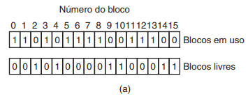

# PF

parei: 238

slides: 1 - 229 - 259 ; 380 - 403 (ao todo cerca de 60 slides)

respostas das provas: https://docs.google.com/document/d/1htvzhlW3EPrYwOh2mBsPRAcDP2JfZFJfiu5Z6QvfnTY/edit?pli=1

## Confiabilidade do sistema de arquivos

- Controle de concorrência
    - Unix: leitura e escrita executadas na ordem em que chegam
    - Problema quando precisa de exclusão mútua
    - Solução mais comum: "locks" (1 por arquivo)
    - Mesmo problema que exclusão mútua, se usuário "pifar" trava o arquivo
    - Nesse caso tem ênfase nos dados, a prioridade é manter os arquivos sem que sejam corrompidos ou perdidos

- Transações
    - Transação: unidade lógica que agrupa operações
    - begin_transaction
    - as operações são executadas normalmente com travas nos recursos
    - porém as alterações só são aplicadas com end_transaction
    - evita problemas quando há falhas e erros, e ajuda a reverter alterações nesses erros

- Cópias de segurança (backups)
    - Recuperação de desastres e erros
    - Lento e alto uso de espaço
    - O que recuperar com o backup? Dump Físico ou Dump Lógico?
    - Dump: cópia ou salvamento de dados para o local de backup

    - Dump Físico
        - Copia o disco inteiro, blocos e setores, bit a bit
        - Simples, mas custoso em tempo e armazenamento
        - Blocos inválidos
            - desperdício de espaço, erros
            - se mantidos pelo hardware ok, pois o próprio hardware está lidando com esse bloco
            - se mantidos pelo SO (sabe quais são os blocos), backup deve saber também e evitar copiá-los
        
    - Dump Lógico
        - Não copia arquivos especiais ((comunicação)pipes,/dev/,etc), executaveis, temporários
        - Copia diretórios específicos e recursivamente seus arquivos

    - Dumps incrementais
        - evita novo backup de arquivos não mudados
        - periodicamente um dump completo e incrementais são feitos
        - mas há uma certa complexidade na recuperação, pois é necessário salvar diretórios não modificados para facilitar a recuperação

    - Unix pode ter "buracos" nos arquivos
        - por causa de operaçoes como a sequencia open, write, seek (deslocamento), write
        - não preencher buracos na recuperação
        - core dump: arquivo sobre a memoria de um programa quando ocorre uma falha, possuem espaço entre código e pilha que nao contem informações relevantes sobre a falha

    - Cuidado com links para evitar duplicação e loops
        - hard links, soft links

## Consistência do sistema de arquivos

- Muitos sistemas de arquivos lêem blocos, os modificam e escrevem posteriormente.

- Se o sistema falhar antes que todos os blocos modificados tenham sido escritos, o sistema de arquivos poderá ficar em um estado inconsistente.
    - Problema crítico se os blocos forem i-nodes
        - diretórios ou lista de regiões livres

- A maioria dos computadores tem um programa utilitário que verifica a consistência do sistema de arquivos.
    - Unix – fsck
    - Windows – chkdsk
    - Esse utilitário pode ser executado quando o sistema for inicializado, especialmente após uma falha.

- Podem ser feitos dois tipos de verificações de consistência: em blocos e em arquivos

- **Em blocos**:
    - Duas tabelas com contadores para cada bloco, inicializados com zero
        - Quantas vezes um bloco está presente em um arquivo
        - Quantas vezes um bloco está presente na lista livre
    - Programa lê todos os i-nodes e percorre lista de blocos
        - Toda vez que bloco é encontrado atualiza primeira tabela
    - Programa percorre lista livre
        - Toda vez que bloco é encontrado atualiza segunda tabela 
    - Se o sistema de arquivos for consistente, cada bloco terá um valor 1 na primeira tabela ou na segunda tabela.
        - Blocos bons => (1,0) ou (0,1)

        

        - Missing block (0,0) => adicionado à lista livre
            - Não prejudicam, mas desperdiçam espaço
        - Bloco com mais de uma ocorrencia em lista livre (0,n) - reconstrói a lista livre

        

        - Pior caso: Blocos presentes em mais de um arquivo (n,0)
            - Se um desses arquivos for removido, o bloco 5 será colocado na lista de regiões livres, levando a uma situação na qual o mesmo bloco está sendo usado e, ao mesmo tempo, está livre. Se os dois arquivos forem removidos, o bloco será colocado na lista de regiões livres duas vezes.
            - A ação apropriada do verifi cador de sistema de arquivos é alocar um bloco livre, copiar o conteúdo do bloco 5 nele e inserir a cópia em um dos arquivos
            - Quase com certeza um bloco está corrompido

- **Em arquivos e diretórios**:
    - Uma tabela com contadores para cada arquivo
    - O verifi cador começa no diretório-raiz e desce recursivamente na árvore, inspecionando cada diretório presente no sistema de arquivos.
    - Incrementa contador toda vez que um i-node é encontrado
    - lembrem-se que arquivos podem ser apontados por mais de um diretório por “hard links”.
    - Os vínculos simbólicos (soft links) não contam e não fazem o contador do arquivo de destino ser incrementado.
    - Contador: quantos diretórios contêm cada arquivo
    - Compara contadores com número de links nos i-nodes respectivos
    - Contagem começa em 1 quando arquivo é criado
    - Dois tipos de erros podem ocorrer: a contagem de vínculos no i-node pode ser maior ou menor do que uma em relação a outra.
    - Link count muito alto (não é grave)
        - Desperdiça espaço
        - Sistema não atualizou contador após remoção
        - Arquivo ficaria no sistema mesmo após dever ser removido
        - Atualiza contador de links
    - Link count muito baixo (grave)
        - Erro mais grave, provocaria remoção premetura do arquivo
        - Atualiza contador de links 

- Essas duas operações, verifi car blocos e verifi car diretórios, são freqüentemente integradas por motivos de efi ciência (isto é, é exigida apenas uma passagem pelos i-nodes).

- Outras ocorrências suspeitas que podem ser reportadas
    - Diretórios com muitos arquivos (e.g. Mais de mil)
    - Permissões estranhas (e.g. 0007)
    - Arquivos em diretório de usuário mas pertencentes ao root e com SETUID ligado (problema de segurança)

## Performance do sistema de arquivos
- O acesso ao disco (memória secundária) é muito mais lento do que o acesso à memória (memória primária).
- Otimizações para melhorar o desempenho:

- **Cache** 
    - Cache é um conjunto de blocos logicamente pertencentes ao disco, mas que são na memória por motivos de desempenho.
    - Blocos sempre carregados na área de cache antes de serem lidos
    - Muitos blocos na cache: usar função hash no endereço do dispositivo e do bloco de disco para determinar rápido se o bloco está presente.
        - (dispositivo + número do bloco)
    - Blocos com mesmo valor de hash são concatenados em uma lista ligada.

    

    - Reposição semelhante aos algoritmos de substituição de memória virtual (removido e reescrito no disco caso tenha sido modificado)
        - Paginação
        - Como caches lidas com menos frequencia (e sempre chamda de sistema) é viável o uso de LRU
        - LRU na ordem exata
    - Para consistência: Blocos devem ser divididos em categorias (i-nodes, blocos indretos, diretórios, blocos de dados complets, blocos de dados parciais)
        - Blocos que não devem ser usados tão cedo vão na frente, outros no final (como blocos que são de arquivos abertos para escrita e que estão parcialmente completos)
        - Os blocos que provavelmente não serão necessários novamente em breve ficam no início, em vez de ficarem no fi m da lista LRU, para que seus buffers sejam reutilizados rapidamente.
        - Os blocos que podem ser utilizados em breve, como um bloco parcialmente completo que está sendo escrito, fi cam no fi m da lista, para que estejam à mão por bastante tempo.
    - Se o bloco é fundamental para a consistência do sistema de arquivos (basicamente tudo exceto os blocos de dados) e foi modificado, ele deve ser escrito no disco imediatamente (write-trhough), independente da extremidade da lista LRU em que seja colocado. Escrevendo os blocos críticos rapidamente, reduzimos enormemente a probabilidade de uma falha destruir o sistema de arquivos.
    - Mesmo assim, não deveríamos deixar blocos modificados sem serem escritos por muito tempo
    - UNIX – syncs periódicos (30 segundos?)
    - Windows – write-through cache. (i.e. USB drives – FAT – em geral são seguros) (grava no disco imediatamente)
    - Porque? (Unix – discos rígidos, Windows – disquetes que podem ser removidos pelo usuário)
    - Caches: Leitura preventiva de blocos
    - Tentar colocar blocos na cache antes de sua leitura/escrita ser requisitada
    - Ex. Maioria dos arquivos lido sequencialmente
    - FS pode ver, quando block K é requisitado, se bloco K+1 está lá, se não estiver, pode requisitar leitura preventiva
    - Como? – supor sequencial inicialmente, quando seek é chamado, supor randomico (sem leitura preventiva)

- **Reduzindo o movimento do braço do disco**
- Colocar blocos que podem ser utilizados sequencialmente próximos um do outro, de preferencia no mesmo cilindro
    - E.g. Se lista livre como bitmap, podemos pegar bloco o mais próximo possível do último escrito
    - Alocar mais de um bloco de cada vez para arquivo
    - I-node: duas leituras, uma para o i-node e outra para o bloco.
    - I-nodes + arquivos: distribuir i-nodes por grupos de cilindros e alocar blocos dos arquivos preferencialmente próximos.
    - Variação – inodes no meio do disco

    
    
## Sistemas de arquivos estruturados como logs

## Segurança

## Threads
